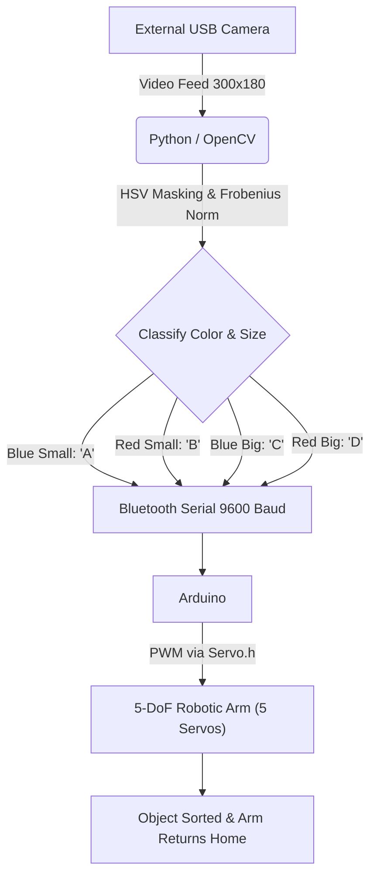

# Object-Sorting Robotic Arm

An automated, vision-guided robotic arm that picks up blocks and sorts them into designated locations based on their **color** (Red or Blue) and **size** (Small or Big).

The hardware is controlled by an **Arduino**, while a **Python/OpenCV** script handles real-time object detection via a webcam and communicates classification results to the Arduino over a **Bluetooth serial** connection.



---

## Key Features

- **Computer Vision-Driven Sorting**: Real-time color and size recognition using HSV color-space filtering and Frobenius norm calculation via OpenCV and NumPy.
- **5-DoF Mechanical Design**: The STL files originate from a **6 Degree-of-Freedom (DoF)** design (credited to the How to Mechatronics YouTube channel). The physical robot was modified to **5 DoF** by attaching the gripper directly to the gripper base, eliminating one joint. The Arduino code (`minorarduino.ino`) controls only 5 servos (`s1`, `s2`, `s4`, `s5`, `s6` (note: `s3` is intentionally absent) to match this 5-DoF configuration.
- **Wireless Communication**: Python sends single-character commands to the Arduino over a Bluetooth serial link, decoupling the vision system from the microcontroller.
- **Smooth Servo Motion**: All servo movements use incremental angle sweeps with small delays to reduce mechanical jitter and strain.

---

## Hardware Requirements

### 1. Electronics & Control
- **Microcontroller**: Arduino Uno (or compatible board).
- **Primary Servos (4x MG995)**: High-torque metal gear servos for the structural joints:
  - **Base**: horizontal rotation
  - **Shoulder**: lower arm pivot
  - **Elbow**: upper arm pivot
  - **Palm / Gripper Base**: wrist tilt
- **Gripper Servo (1x SG-90)**: Lightweight plastic gear servo for the claw (open/close).
- **Bluetooth Module**: For wireless serial communication between Python and Arduino (connected as a serial port on the PC, e.g., COM5).
- **Power Supply**: External **5V-6V DC, minimum 3A**.

> [!IMPORTANT]
> Do not power the MG995 servos from the Arduino's 5V pin. Their combined peak current draw will brown out or damage the microcontroller. Use a dedicated external power supply with a common ground shared with the Arduino.

### 2. 3D Printed Parts (STL Files)

The frame is assembled from **10 STL files** located in the `STL/` directory. These files are freely available from the How to Mechatronics YouTube channel and were originally designed for a 6-DoF arm.

| Category | Files |
| :--- | :--- |
| **Chassis & Swivel** | `Base.STL`, `Waist.STL` |
| **Arm Linkages** | `Arm 01.STL`, `Arm 02 v3.STL`, `Arm 03.STL` |
| **Gripper Assembly** | `Gripper base.STL`, `Gripper 1.STL`, `grip link 1.STL` |
| **Transmission Gears** | `gear1.STL`, `gear2.STL` |

> [!NOTE]
> Although the STL files support 6 DoF, the physical build is **5 DoF**. The gripper (`Gripper 1.STL`) and gripper base (`Gripper base.STL`) are attached together as a single unit, removing one rotational joint. The Arduino code is written accordingly - servo `s3` is not defined.

---

## Wiring & Pin Mapping

| Servo (Code) | Physical Joint | Arduino Pin | Servo Model | Notes |
| :---: | :--- | :---: | :--- | :--- |
| `s1` | Claw / Gripper | **Pin 2** | SG-90 (Plastic) | Opens/closes to grip objects |
| `s2` | Palm / Wrist | **Pin 3** | MG995 (Metal) | Tilts the wrist down to reach objects |
| `s4` | Elbow | **Pin 5** | MG995 (Metal) | Upper arm pivot |
| `s5` | Shoulder | **Pin 6** | MG995 (Metal) | Lower arm pivot |
| `s6` | Base | **Pin 7** | MG995 (Metal) | Rotates entire arm horizontally |
| `None` | Indicator (unused servo) | **Pin 10** | None | Set as OUTPUT; no servo attached |

> [!NOTE]
> There is no `s3` servo. This is intentional - the 6th DoF joint was removed when the gripper and gripper base were attached together. Pin 10 is configured as an `OUTPUT` in the code but is not connected to a servo; it may have been used for an LED indicator or buzzer.

All servo grounds must be tied to both the external power supply ground and the Arduino GND to establish a common reference.

---

## Software

### Dependencies
```bash
pip install pyserial opencv-python numpy
```

### File Overview

| File | Language | Purpose |
| :--- | :--- | :--- |
| `object_detect.py` | Python | Captures camera feed, detects object color & size, sends classification byte over Bluetooth serial |
| `minorarduino.ino` | C++ (Arduino) | Receives serial commands, executes pick-and-place servo sequences, returns to home position |

### Arduino Upload
1. Open `minorarduino.ino` in the Arduino IDE.
2. Select your board (e.g., Arduino Uno) and the correct COM port.
3. Upload.

---

## How It Works

### Step 1: Object Detection (object_detect.py)

The script opens an **external USB camera** (device index 1) at a resolution of **300x180 pixels** and runs a continuous detection loop:

1. **BGR to HSV Conversion**: Each frame is converted to the HSV color space for lighting-robust color detection.
2. **Color Masking**: Pixels are filtered using predefined HSV ranges:
   | Color | Low Bound | High Bound |
   | :--- | :--- | :--- |
   | **Red** | `[161, 155, 84]` | `[179, 255, 255]` |
   | **Blue** | `[94, 80, 2]` | `[126, 255, 255]` |
3. **Size Estimation via Frobenius Norm**: The script computes `np.linalg.norm()` on the masked image arrays. This produces the Frobenius norm (square root of the sum of all squared pixel values), which scales with how many pixels matched the color - i.e., the apparent size of the object.
   | Norm Range | Classification |
   | :--- | :--- |
   | < 9,000 (both colors) | No object (`"null"`) |
   | 9,000 - 10,000 | Dead zone (no return value) |
   | 10,001 - 20,000 | **Small** object |
   | > 20,000 | **Big** object |
4. **Display Windows**: Three OpenCV windows are shown in real time - the raw frame, the red mask, and the blue mask - along with printed norm values for debugging.

### Step 2: Serial Command Transmission

Once the object is classified, Python sends a **single ASCII byte** over the Bluetooth serial connection and then **sleeps for 30 seconds** to allow the full mechanical pick-and-place sequence to complete:

| Detection | Return Code | Serial Byte Sent | Meaning |
| :--- | :---: | :---: | :--- |
| Blue, Small | `"bs"` | `'A'` | Small blue block |
| Red, Small | `"rs"` | `'B'` | Small red block |
| Blue, Big | `"bb"` | `'C'` | Big blue block |
| Red, Big | `"rb"` | `'D'` | Big red block |

Press **ESC** to exit the detection loop.

### Step 3: Servo Execution (minorarduino.ino)

When the Arduino receives a byte, it executes the following sequence:

1. **Approach** (common to all commands):
   - Base (`s6`): sweeps 90 to 0 degrees - rotates to the object pick-up zone
   - Shoulder (`s5`): sweeps 90 to 50 degrees - lowers the arm
   - Elbow (`s4`): sweeps 90 to 110 degrees - extends forward
   - Claw (`s1`): sweeps 90 to 180 degrees - opens wide
   - Palm (`s2`): sweeps 90 to 40 degrees - tilts wrist down to the object

2. **Grab**:
   - Claw (`s1`): sweeps 180 to 0 degrees - closes and grips the block
   - Palm (`s2`): sweeps 40 to 100 degrees - lifts the wrist back up
   - Shoulder (`s5`): sweeps 45 to 90 degrees - raises the arm

3. **Sort** (varies by command - base rotates to a different target angle):

   | Command | Object | Base Target Angle |
   | :---: | :--- | :---: |
   | `'A'` | Small Blue | **180 degrees** |
   | `'B'` | Small Red | **165 degrees** |
   | `'C'` | Big Blue | **180 degrees** |
   | `'D'` | Big Red | **155 degrees** |

   After rotating the base, the arm lowers, opens the claw to release the block, then retracts.

4. **Home**: All servos return to their neutral **90 degrees** position through smooth sweeps.

> [!NOTE]
> In the Arduino source code, `case 'D'` has a comment that reads *big blue*, but based on the Python detection logic it actually handles **big red** blocks. This is a minor comment typo in the original code.

---

## Calibration & Customization

### 1. Serial Port Configuration

The Python code initializes the serial port with a **placeholder string** `'Serial Port'`. You must replace this with your actual Bluetooth COM port before running:

```python
# BEFORE (placeholder: will not work as-is):
ser = serial.Serial('Serial Port', 9600, timeout=1)

# AFTER (replace with your port):
ser = serial.Serial('COM5', 9600, timeout=1)   # Windows
ser = serial.Serial('/dev/ttyUSB0', 9600, timeout=1)  # Linux
```

To find the correct port on Windows, open Device Manager, Ports (COM & LPT) and look for the Bluetooth serial port.

### 2. Camera Selection

The script uses camera index 1 (an external USB camera). If you want to use your built-in webcam instead:
```python
cap = cv2.VideoCapture(0)  # Change 1 to 0 for default webcam
```

### 3. HSV Color Calibration

If colors are not being detected under your lighting conditions, adjust the HSV bounds:
```python
# Red color thresholds
low_red = np.array([161, 155, 84])
high_red = np.array([179, 255, 255])

# Blue color thresholds
low_blue = np.array([94, 80, 2])
high_blue = np.array([126, 255, 255])
```

> [!TIP]
> Use the debug windows (Red and Blue mask views) and the printed norm values to tune these thresholds in real time.

### 4. Size Thresholds

Adjust the norm boundaries if your camera distance or resolution differs:
```python
if (red > 10000) or (blue > 10000):     # Detection threshold
    if (red <= 20000) and (red > blue):  # Small vs Big boundary
        return "rs"  # Red Small
```

---

## Troubleshooting

| Problem | Likely Cause | Fix |
| :--- | :--- | :--- |
| **Servos jitter or Arduino resets** | Insufficient power supply current | Use a dedicated **5V 3A+** external supply for the servos. Never power MG995 servos from the Arduino 5V pin. |
| **Python can't open serial port** | Port conflict | Close the Arduino IDE Serial Monitor before running `object_detect.py`. Only one program can hold a COM port. |
| **Object detected but arm doesn't move** | Missing common ground | Connect the GND of the external power supply to an Arduino GND pin. |
| **No detection / norm always near 0** | Wrong camera index | Try changing `cv2.VideoCapture(1)` to `cv2.VideoCapture(0)`. |
| **Colors detected incorrectly** | HSV range doesn't match lighting | Use the live mask windows to calibrate `low_red`/`high_red` and `low_blue`/`high_blue`. |
| **Serial port placeholder error** | `'Serial Port'` not replaced | Replace the placeholder in `object_detect.py` with your actual Bluetooth COM port (e.g., `'COM5'`). |

---

## Repository Structure

```
Object-Sorting-Robotic-Arm/
├── README.md              # This documentation
├── object_detect.py       # Python: camera capture, color/size detection, serial transmission
├── minorarduino.ino       # Arduino: serial receive, servo pick-and-place control
└── STL/                   # 3D printable parts (originally 6-DoF, modified to 5-DoF)
    ├── Base.STL
    ├── Waist.STL
    ├── Arm 01.STL
    ├── Arm 02 v3.STL
    ├── Arm 03.STL
    ├── Gripper base.STL
    ├── Gripper 1.STL
    ├── grip link 1.STL
    ├── gear1.STL
    └── gear2.STL
```

---

## Credits

- **3D Model STL Files**: Freely available from the How to Mechatronics YouTube channel.
